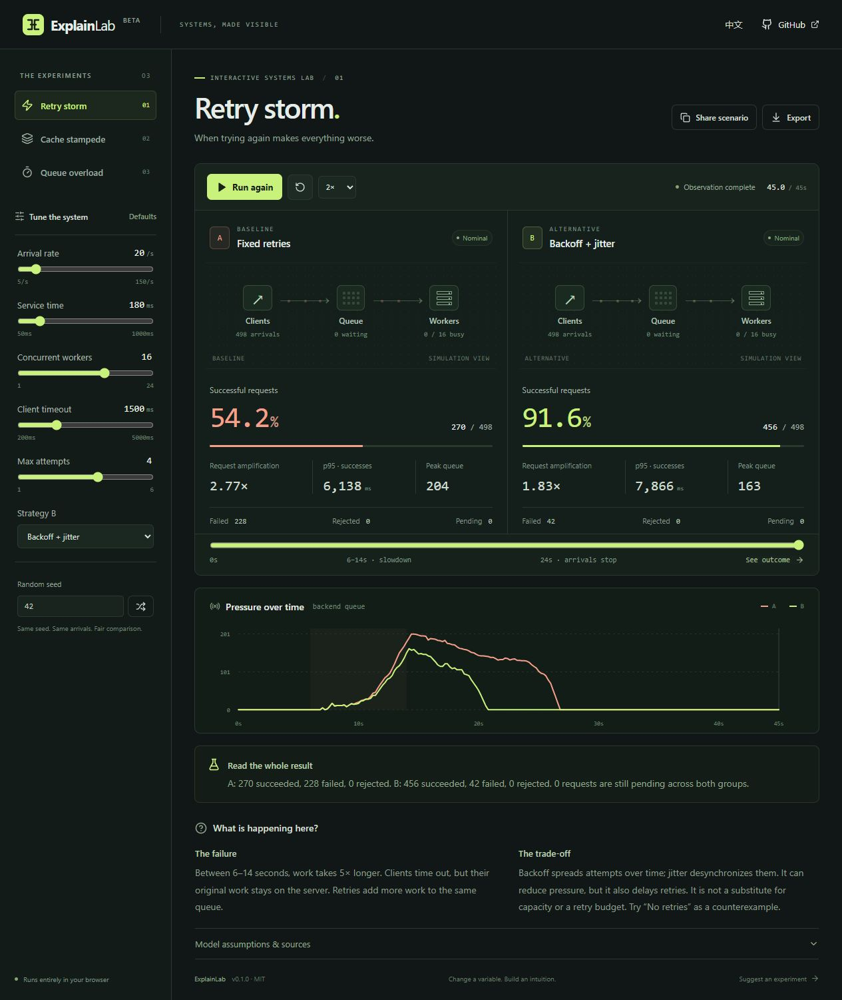

<p align="center"></p>

<h1 align="center">ExplainLab</h1>
<p align="center"><strong>Break a system. Understand the fix.</strong><br>Interactive systems experiments you can play, compare, and share.</p>
<p align="center"><a href="https://zhzhg-dev.github.io/explainlab/">Open the lab ↗</a> · <a href="README.zh-CN.md">简体中文</a> · <a href="docs/MODEL.md">How the model works</a></p>
<p align="center"><a href="https://github.com/zhzhg-dev/explainlab/actions/workflows/pages.yml"></a> </p>



Reading about a retry storm is easy. Seeing your “helpful” retries fill a queue is different.

ExplainLab is a small, open-source lab for building that intuition. Two strategies receive **the same seeded workload**. Change the load, deadline, or capacity; watch requests move; inspect the numbers. No account, API key, backend, or third-party app analytics.

## Three experiments

| Experiment         | Compare                                                          | Question to explore                                  |
| ------------------ | ---------------------------------------------------------------- | ---------------------------------------------------- |
| **Retry storm**    | Fixed retries vs no retries, exponential backoff, or full jitter | When do retries prevent recovery?                    |
| **Cache stampede** | Independent origin fetches vs single-flight coalescing           | How much work does one expired hot key create?       |
| **Queue overload** | A 240-slot queue vs a configurable bounded queue                 | Can accepting less work produce more useful results? |

## Try this in 30 seconds

1. [Open the lab](https://zhzhg-dev.github.io/explainlab/) and run **Retry storm**.
2. At 6 seconds, the service becomes 5× slower. It recovers at 14 seconds.
3. Compare **success**, **request amplification**, and **peak queue**. Scrub the timeline or select **See outcome**.
4. Raise the arrival rate to 30/s and run again. Backoff is not magic: both strategies can fail under sustained pressure.
5. Copy **Share scenario** to reproduce your parameters and seed; **Export** saves the current results as a PNG.

The default retry scenario is intentionally near a recoverable capacity boundary so policy differences are visible. It is a teaching example, **not evidence that one strategy wins universally**.

## Features

- Deterministic discrete-event simulation in a Web Worker.
- Fair A/B arrivals, with service costs independent of retry randomness.
- Play, pause, scrub, reset, and 1×–8× playback.
- Validated, versioned scenario URLs; no server required to share.
- PNG snapshots containing real metrics, parameters, seed, and model version.
- English / 简体中文, responsive layout, keyboard controls, reduced-motion support.
- Explicit failed, rejected, and pending counts. Successful-request latency never hides failures.

**Important model limits:** service work continues after client timeouts; cache hits have zero modeled latency; only one hot key is simulated. Network delays and real distributed coordination are omitted. See [MODEL.md](docs/MODEL.md) before interpreting results. This is not a load-testing tool or a production sizing calculator.

## Run locally

Requires **Node.js 24+** and npm.

```bash
git clone https://github.com/zhzhg-dev/explainlab.git
cd explainlab
npm ci
npm run dev
```

Open the address Vite prints, normally `http://127.0.0.1:5173/explainlab/`.

```bash
npm run check         # TypeScript + simulation invariants and URL validation
npm run build         # Production output in dist/
npm run preview       # Serve the production build locally
npm run format        # Format source and documentation
```

The GitHub Actions workflow checks and builds every pull request. Pushes to `main` deploy the validated artifact to GitHub Pages. To deploy a fork, enable **Settings → Pages → GitHub Actions** and adjust the repository base path in `vite.config.ts` if renamed.

## Project map

```text
src/engine.ts       Discrete-event queue, seeded workloads, three models
src/model.ts        Scenario schema, bounds, URL validation, frame types
src/worker.ts       Simulation worker boundary
src/App.tsx         Workbench, controls, visualizations
src/content.ts     Bilingual lessons and primary references
src/export.ts      Canvas result snapshots
src/engine.test.ts  Determinism, accounting, deadlines, limits, sharing
docs/MODEL.md      Model assumptions and measurement definitions
```

## Help shape the next experiment

Small, accurate experiments are more useful than a giant catalogue. Ideas for later releases include circuit breakers, load balancing, and cache eviction. These are ideas, not implemented features.

Found a misleading result? Open an issue with the scenario link, what you expected, and the model assumption in question. Contributions to correctness, accessibility, translations, and reproducible examples are especially welcome. See [CONTRIBUTING.md](CONTRIBUTING.md).

Inspired by the engineering explanations from [AWS](https://aws.amazon.com/blogs/architecture/exponential-backoff-and-jitter/), [Cloudflare](https://blog.cloudflare.com/sometimes-i-cache/), and [Google SRE](https://sre.google/sre-book/handling-overload/). This project is independent of those organizations.

## License

[MIT](LICENSE) © 2026 zhzhg-dev. Interface icons: [Lucide](https://lucide.dev), ISC license. No third-party diagrams or illustrations are copied.
